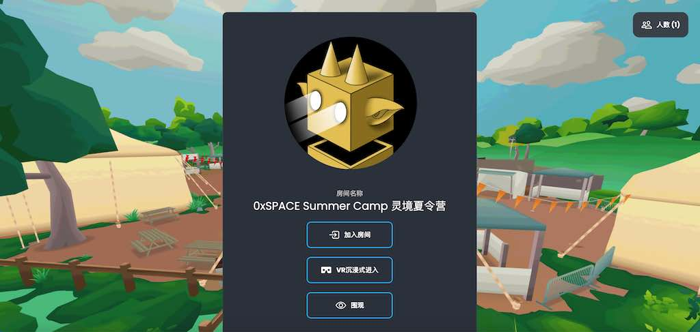
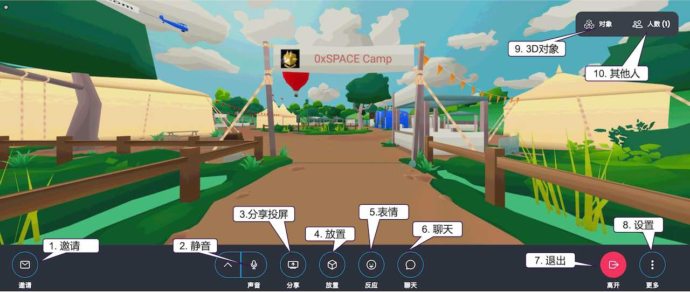
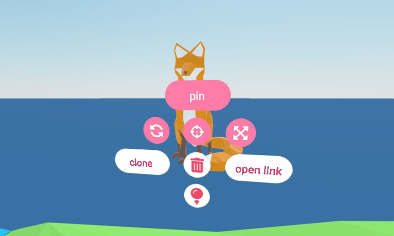
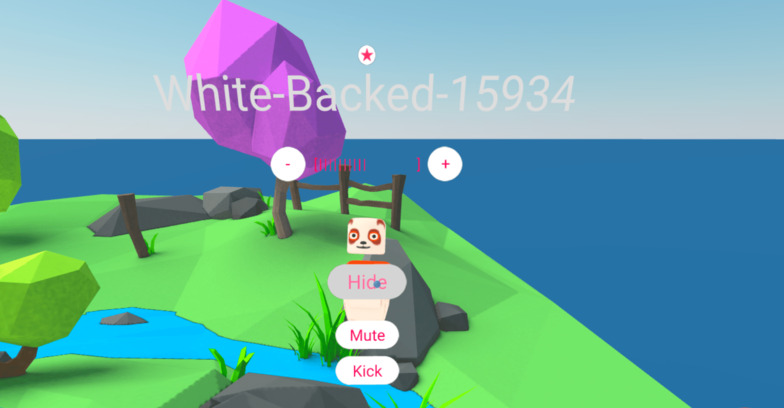

# 0xSPACE 灵境元宇宙入门

在下面的指南中，我们将向您展示0xSPACE的基础知识！请前往[www.0xspace.net 网站](https://www.0xspace.net/)。通过点击进入一个公共房间游览，并可以与其他人交流互动。

要创建您自己的房间，请前往[0xspace.net 网站](https://0xspace.net/)。通过点击"**创建房间**"来创造一个你自己的房间；创建的房间是私人的，除非你发送邀请链接给别人，否则任何用户都无法进入。

恭喜-你现在有了自己的虚拟空间！

## 进入房间

在进入房间之前，你可以在房间的大厅里选择 **围观**。从这里，你可以看到和听到房间里发生了什么，你只能通过文字聊天与其他人互动。进入房间则于此不同，可以与房间内用户实时互动。

**在台式电脑或者移动手机上？**

- 单击“进入房间”并按照提示选择姓名/头像并启用麦克风。

**在VR虚拟现实耳机上？**

- 如果您在桌面或智能手机上打开了URL，请选择“**VR沉浸方式进入**”将指导您轻松地在VR虚拟现实耳机上打开虚拟场景（如：Oculus Quest、Pico Neo3、Samsung Gear）。
  
  打开VR头戴虚拟现实耳机中的浏览器，导航至[https://www.0xspace.net](https://www.0xspace.net)，然后点击你想浏览的虚拟空间。

## 

## 探索 0xSPACE

#### 看看周围

尝试探索你的新空间。在桌面电脑上使用**WASD**或者箭头键来移动。你也可以按鼠标右键传送到不同的位置。旋转视图可以按 **Q** 和 **E** 键或者按鼠标左键拖动。

关于虚拟现实和移动控制，请参见我们后面的控制列表

### 用户界面

试试用户界面。您可以静音麦克风、拍照、共享屏幕、创建对象等等。我们将在本指南中介绍其中一些控件的基础知识。

### 

### 导入媒体

在0xSPACE中，您可以导入3D模型、图像、视频和PDF文件（上传到MyAsset我的资产）。

尝试在媒体浏览器（屏幕顶部的魔棒按钮）中搜索内容。

也可以通过将文件拖放到虚拟房间中，或复制文件URL（ctrl + c或command + c），然后将其粘贴到房间中（ctrl +v或command +v）来添加媒体文件。

### 对象菜单

3D对象、视频和图形的其他控件可以在其Object对象菜单中找到。

要显示这些控件，请将光标悬停在对象上，然后按桌面上的空格键或tab键。

### 

### 头像菜单

您可以在用户上打开菜单，就像在对象上一样。这使您可以控制它们的音量或在视图中隐藏它们。如果你是一个房间主人（创建者）或主持人，你将有额外权限，例如可以静音用户麦克风或将他们踢出房间。

### 改变场景

你可以改变你的场景来适应你活动的气氛。在我们的场景库中有不同的场景可选择，或者您可以使用我们的Scene场景编辑器创建您的自定义空间。打开下拉菜单并选择“选择场景”来浏览“场景浏览器”。

注意，只有房间主人或者创建者可以更改场景。您可以使用电子邮件登录，并上传自定义头像等。0xSPACE只需要电子邮件来验证您的帐户-不需要任何额外的信息。

## 邀请朋友

你的空间是私人的，除非你邀请其他人或者朋友，否则其他人不能加入。

当您准备邀请其他人时，请单击屏幕左下方的“邀请”按钮。复制房间链接URL，并将其通过微信、邮件、短信等实时发送给您的朋友。

## 下一步

这只是对0xSPACE的基本功能的简要概述。有关在0xSPACE可以做什么的详细概述，请继续看下一章
