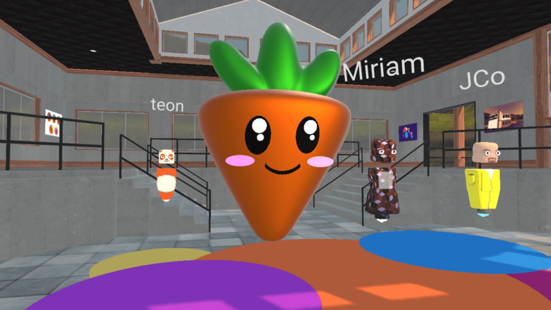
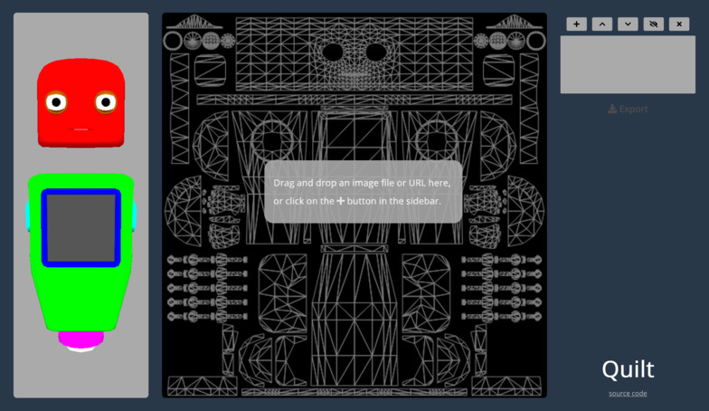
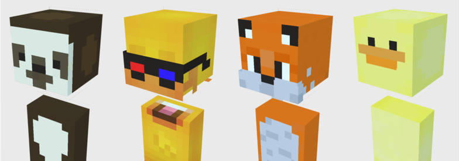

# 创建自定义头像

在**0xSPACE**，你可以选择定制上传自己喜欢的头像，或创建您自己的头像。

根据你在虚拟人物创建过程中的参与程度，你可以选择简单地给一个基本虚拟化身穿上**“蒙皮**”，或上传你自己的虚拟化身3D模型。

## 给机器人或盒子机器人虚拟化身“换皮”

为**0xSPACE**定制数字化身的最直接的方法是在其中一个基础机器人虚拟化身上上传一个自定义纹理皮肤。为此：

1. 进入0xSPACE 房间
2. 选择屏幕右上角的“**人员**”列表图标。
3. 按你的名字，你会看到一个铅笔图标。单击此图标打开头像选择屏幕。
4. 点击“**浏览虚拟化身**”按钮。
5. 从这里，你可以看到你自己的虚拟化身列表，并“**创建化身**”。
6. 在定制屏幕中，选择一个默认的化身形象。
7. 点击“基础图形”，上传一个图像文件。如果想为机器人虚拟化身自定义皮肤纹理，请参见下面的详细信息。
8. 保存你的虚拟化身
   
   

### 创建机器人虚拟化身皮肤

为机器人设计新皮肤的最简单方法是使用蒙皮工具将皮肤图像文件加载，预览自定义机器人化身的形象，并导出单个纹理贴图文件。你自己试试吧 [自定义皮肤.io](http://tryquilt.io/) .

### 创建盒子机器人纹理

为一个盒子机器人创建一个新的皮肤最简单的方法是使用一个Minecraft头像构建工具来创建你自己的皮肤，或者在线搜索creativecommons Minecraft皮肤。

## 高级头像定制

有关自定义中心头像的更多信息，如纹理图、可下载模板和使用您自己的三维模型的说明，请查看后面高级头像定制文件的一节

