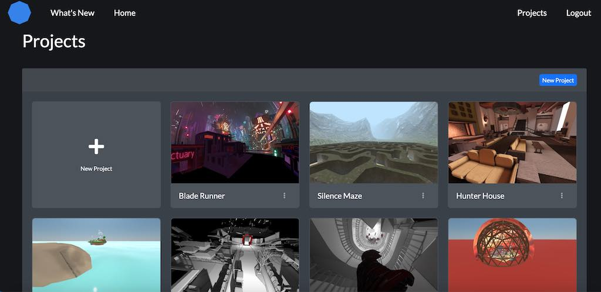

# 欢迎来到 0xSPACE-灵境元宇宙

0xSPACE是一个在Web浏览器中运行的元宇宙虚拟空间社交平台。在灵境元宇宙0xSPACE中，你只需单击一下就可以创建自己的虚拟空间。使用URL链接邀请朋友加入。无需安装APP或应用程序商店。

![ []谁是0xSPACE？](imgs/1.jpg)

0xSPACE是在元宇宙虚拟空间中进行虚拟社交和共享活动的最佳平台。

主持虚拟会议，虚拟培训课程，展示数字艺术作品，或者只是和朋友在元宇宙中聊天闲逛。 0xSPACE将虚拟空间中共享图像、视频、3D立体模型等变得非常容易。有了0xSPACE的空间化音频，你可以和每个人在一起聊天，或者分成几个小组——就像在现实空间中面对面一样。

0xSPACE支持跨平台工作。有VR虚拟现实耳机吗？你将看到立体虚拟空间（Oculus、Pico NEO、 Windows Mixed Reality, Vive）！

或者使用您的台式机、笔记本电脑、平板电脑或手机进行虚拟空间快速浏览。

## 什么是场景编辑器（Scene Editor）

**Scene Editor**是一个内置的场景编辑器，用于创建0xSPACE 中使用的虚拟空间环境。编辑器完全在浏览器中运行，允许上载自己的三维模型、图像和文件，以便在项目中使用。Scene还包含构建工具包和与3D内容集成，帮助构建快速完美的虚拟空间！
