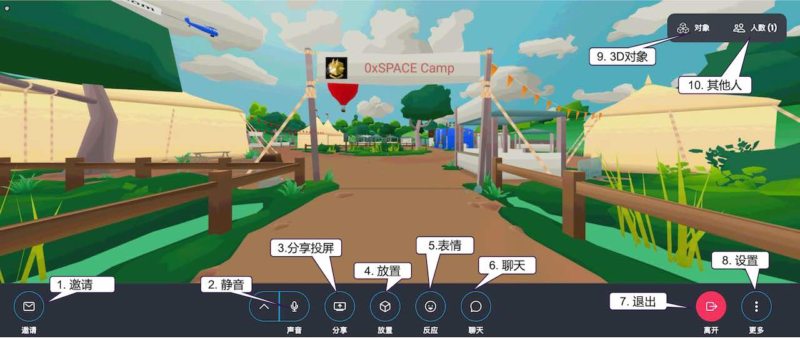
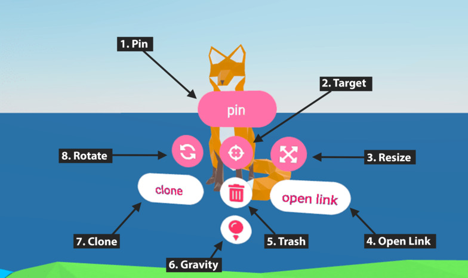
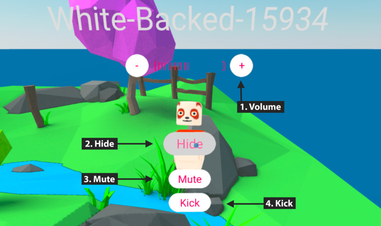
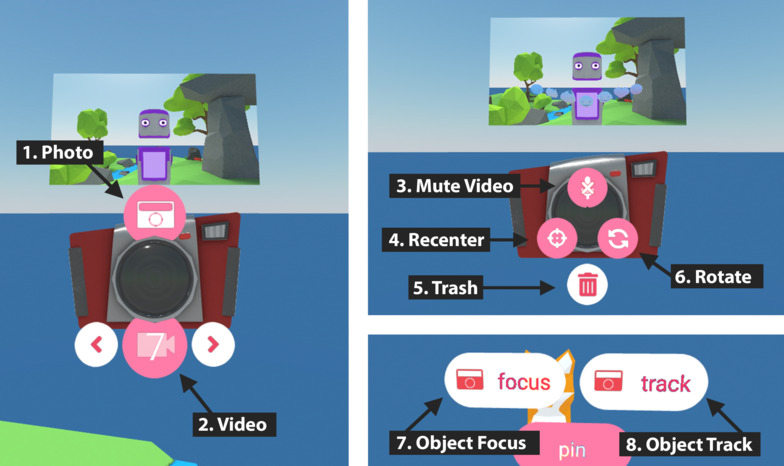
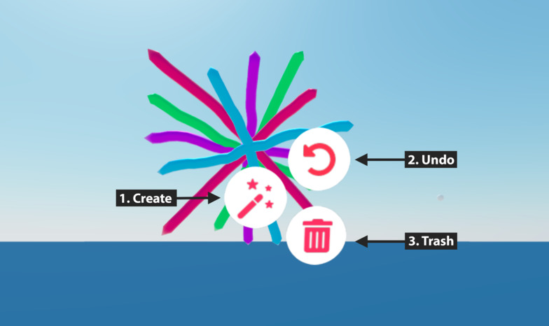
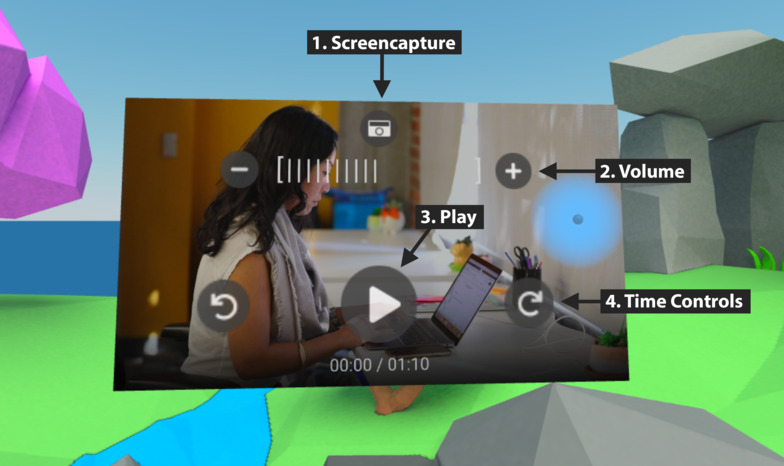
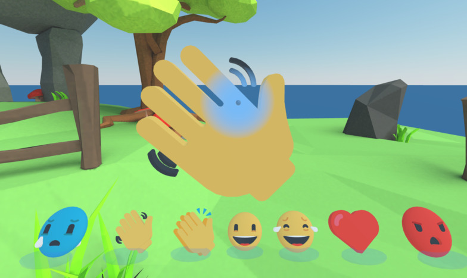
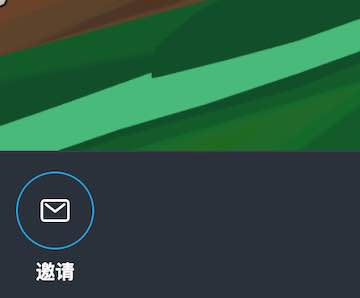

# 灵境空间功能



## 用户界面

1. **邀请**打开一个对话框，其中包含有关与朋友共享文件室的信息。

2. **静音**打开/关闭麦克风

3. **分享**使您能够与会议室成员共享桌面、网络摄像头或手机摄像头。共享媒体将像视频一样出现在房间中。再次单击此按钮，可以删除媒体

4. **放置**打开搜索工具以查找可以带到虚拟房间的媒体。从3D模型、场景、头像和GIF中选择，或提供图像、视频、模型或场景的URL或文件。下面列出了可以放置的其他对象：
   
   - **笔**允许您在三维空间中涂鸦画图。您可以更改笔的大小和颜色，撤消笔划，并从图形生成三维模型.
   
   - **相机**创建一个相机对象，该对象可以拍摄房间的照片和视频，然后将它们作为对象添加到房间中。当您拍摄照片或视频时，聊天室中还会显示一个链接。再次单击“摄影机”按钮以删除摄影机对象。

5. **表情**打开一个菜单，从中可以选择要在文件室中生成的表情符号。

6. **聊天室：**允许您通过文本聊天、创建对象或输入命令进行聊天。命令包括：

```
/leave - 退出房间.
/grow - 增大虚拟化身尺寸.
/shrink - 减小虚拟化身尺寸.
/duck - 创建一个鸭子3d模型.
/debug - 打开debug模式.
/vrstats - Toggle stats in VR.
/scene <scene url> - 改变场景(管理员).
/rename <new name> - 重命名房间 (管理员).
/audiomode - 切换左右声道 (experimental).
/audioNormalization <factor> - 音效级别 (experimental)
/fly - 打开/关闭飞行模式
```

7. **离开**离开你现在所在的房间

8. **更多**打开面板以显示可用的其他命令。从该菜单中，您可以收藏房间、修改用户首选项、访问帮助和其他设置。如果您是房间创建者，此菜单还将包括房间权限设置和当前场景相关的设置。

9. **物体**显示当前房间中的媒体列表。单击列表中的对象以获取更多选项。

10. **人员**显示房间和大厅中人员的信息。显示房间游客的数量、名称和设备类型。也可以从此列表访问高级用户控件。

## 菜单

房间对象和虚拟化身头像都有自己的菜单。要在电脑上显示它们，请将光标悬停在对象上，然后按空格键（或制表符）。

### 对象菜单



1. **Pin码：**使对象在您离开时留在房间中。默认情况下，对象在其创建者退出时消失。
2. **目标：**打开对象的聚焦视图。此菜单项用于媒体对象。
3. **调整大小：**调整对象大小
4. **打开链接：**在新的浏览器选项卡中打开对象的URL。
5. **垃圾桶：**从场景中移除对象
6. **重力：**使物体掉到地板上
7. **克隆：**复制对象
8. **旋转：**旋转对象
9. **放大：**在视图中显示对象的详情图。此菜单项用于媒体对象。
10. **转换为图像：**将对象转换回图像。如果对象源于图形，则显示此菜单项。

### 虚拟化身菜单



1. **音量：**更改用户音频的音量。（不影响房间中其他人的音量。）
2. **隐藏：**隐藏用户的头像和音频。这只适用于当前会话；一旦你刷新你会再次看到他们。其他人仍然可以看到和听到用户的声音。
3. **静音：**将用户的麦克风静音，以便房间中的任何人都听不到。（仅限于管理员。）
4. **踢：**将用户踢出房间。（仅限于管理员。）

### 相机菜单



1. **照片**获取静态图像，然后将其作为对象添加到房间中。

2. **视频**录制视频，然后将其作为对象添加到房间中。使用箭头调整录制长度。请注意，视频记录暂时保存到浏览器存储；如果浏览器空间不足，正在进行的录制可能会丢失。如果您希望录制事件，我们建议使用屏幕录制工具
   
   此功能在Safari上不可用。

3. **静音：**控制视频中是否包含音频。

4. **重新聚焦:**将相机重新定向以面向您。

5. **垃圾桶：**从场景中移除相机

6. **旋转：**旋转相机

7. **对象焦点：**重新定向相机机以面向对象或用户。

8. **对象轨迹：**使相机旋转以跟随对象或用户。

### 涂鸦



1. **创建：**使图形成为三维对象
2. **撤消：**删除最后一个笔划
3. **垃圾桶**从场景中移除图形

## 视频控制

将光标悬停在视频上以显示其视频控件。



1. **截屏：**获取视频的屏幕截图，然后将其作为对象添加到房间中。
2. **音量：**为您更改音频播放的音量。（不影响房间中其他人的音量。）
3. **播放/暂停：**播放/暂停视频
4. **时间控制：**在视频中向前/向后跳转。

## 表情

显示时将显示表情生成器的菜单.



“表情符号”菜单允许您生成一个可抓取的表情符号，该表情符号在震动时会发射粒子。释放表情符号几秒钟后就会被删除。

## 邀请

“邀请”按钮打开一个对话框，其中包含邀请链接，以便与其他人共享房间，这样用户可以加入您的房间。



您可以复制邀请链接URL来分享房间, `iframe`HTML代码（如果您有房间管理权限，则显示）允许您将房间嵌入第三方网页中。


