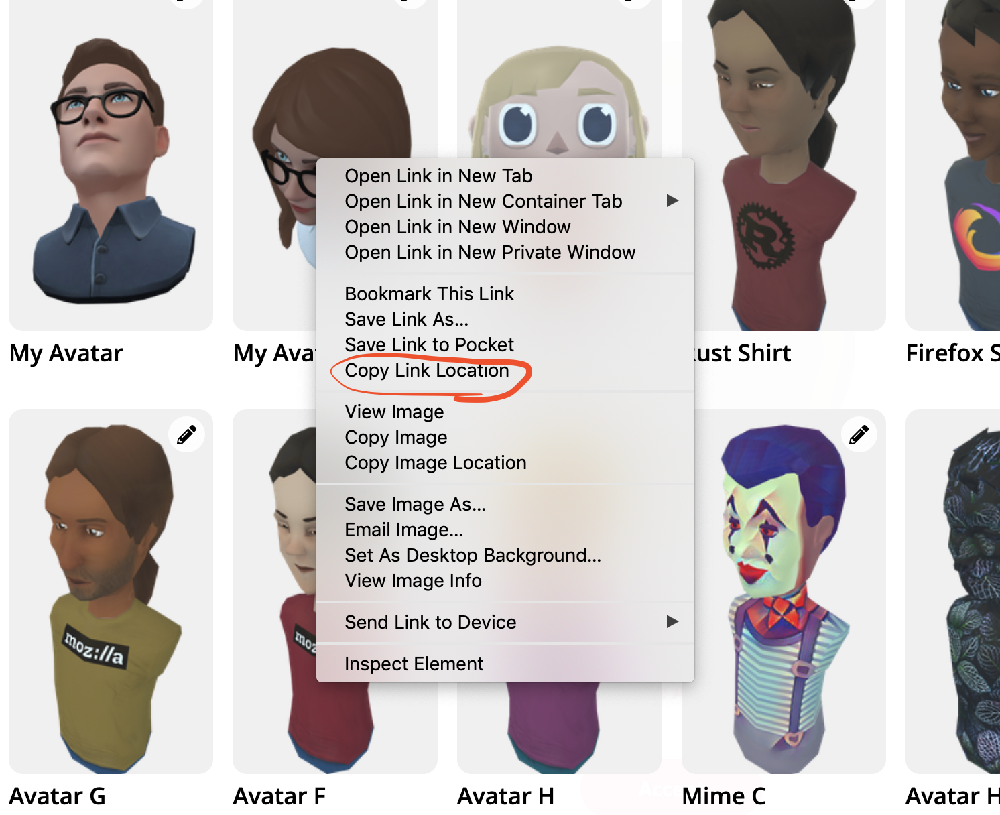
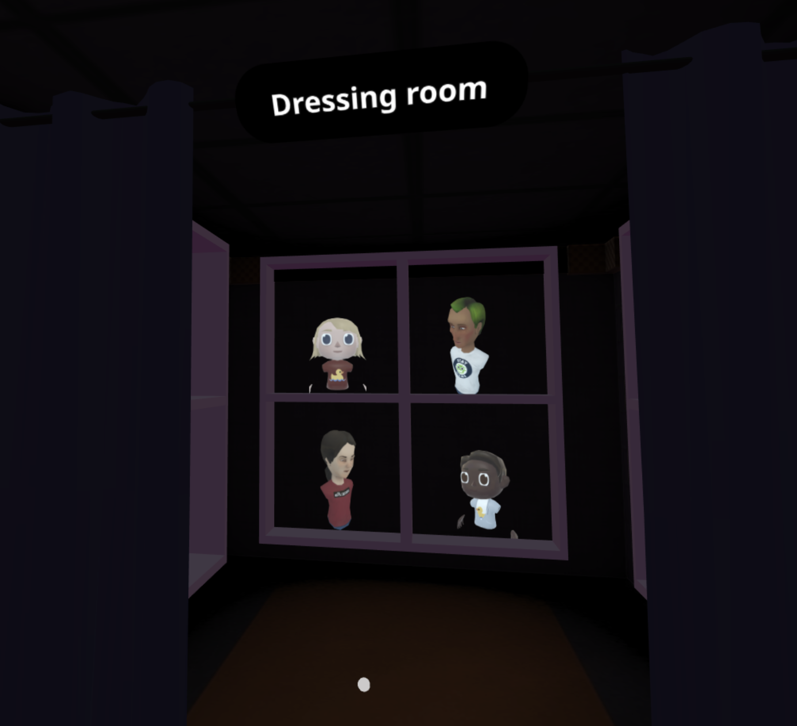

# 定制虚拟化身

**你是否有一个0xSPACE虚拟房间，你想使用自定义的虚拟化身头像？如在一个活动中，表演者拥有一个专属的头像，或主持人穿着定制的主持人衬衫？**如果是这样，请继续阅读。。。

如果你要创建自定义头像，可以将二维纹理集或三维GLB模型文件发送到虚拟房间并上传。

或者，如果你想让活动组织者更特别，你可以为需要自定义虚拟化身的人们创建一个“更衣室”。这是一个房间，展示不同的虚拟化身供人们佩戴。

### 创建更衣室

1. 创建一个新房间作为“更衣室”。
2. 上传一个你想分享的特殊化身头像，然后在你的“我的头像”列表中找到它。
3. 在浏览器中右键单击它并选择“复制链接位置”。

4. 回到更衣室，然后按CTRL+ V（Mac上的Command + V）。化身头像将作为对象添加到房间中。
5. 固定（Pin）住这个物体，这样当你离开房间时它不会消失。（将光标悬停在其上，按空格键，然后选择“**固定**” 或 “**Pin**”。）
6. 与其他人分享这个更衣室的网址。要更换虚拟化身头像，用户只需点击想要的头像，然后选择“使用头像”。

下面是一个“更衣室”的示例截图：

