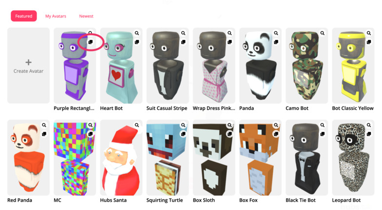
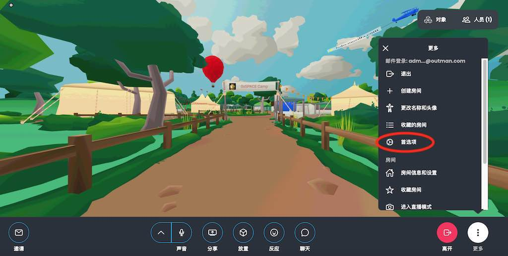

# 用户设置

## 更改姓名和头像

当你第一次进入一个灵境虚拟房间时，你会选择一个名字和一个头像。你可以通过点击屏幕左上角的“人物”菜单并从列表中选择你自己的名字来随时更改他们.

### 我的化身

为了快速访问您最喜欢的头像，您可以将其保存到“我的化身”以快速访问。按“复制到我的头像”图标与头像在头像选择屏幕。

## 首选项

高级用户首选项（例如，媒体音量、移动控制、图形分辨率等）可在下拉菜单的“用户首选项”部分找到。

## 用户帐户

用户使用0xSPACE时不需要帐户，但某些功能只有账户登录后才可用。其中包括：

- 上传自定义头像
- 将化身保存到“我的化身”。
- 变换场景
- 上传自定义场景
- 将对象固定在房间中
- 使用房间调节工具
- 将房间保存到收藏夹

建立一个新帐户，只需要一个电子邮件地址。

