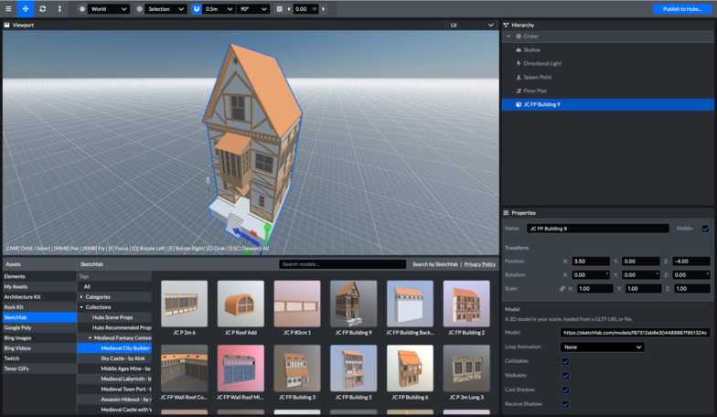
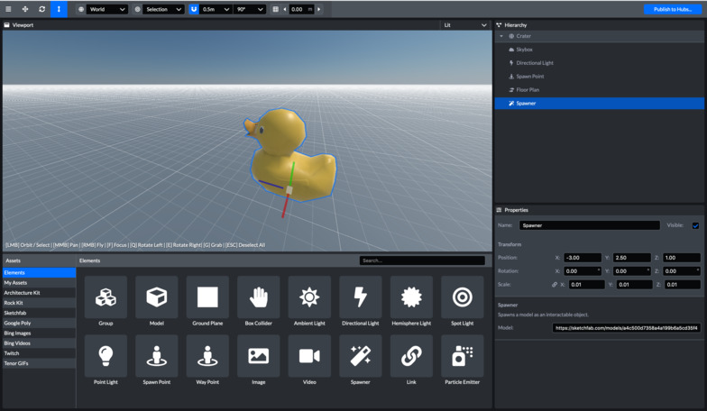
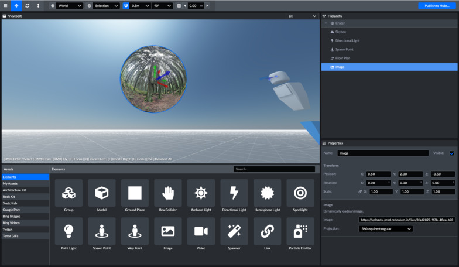
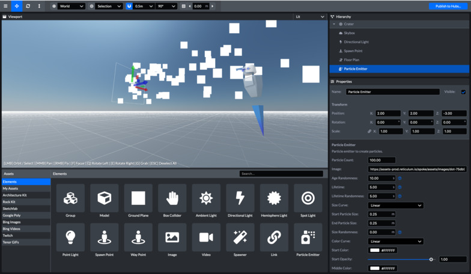
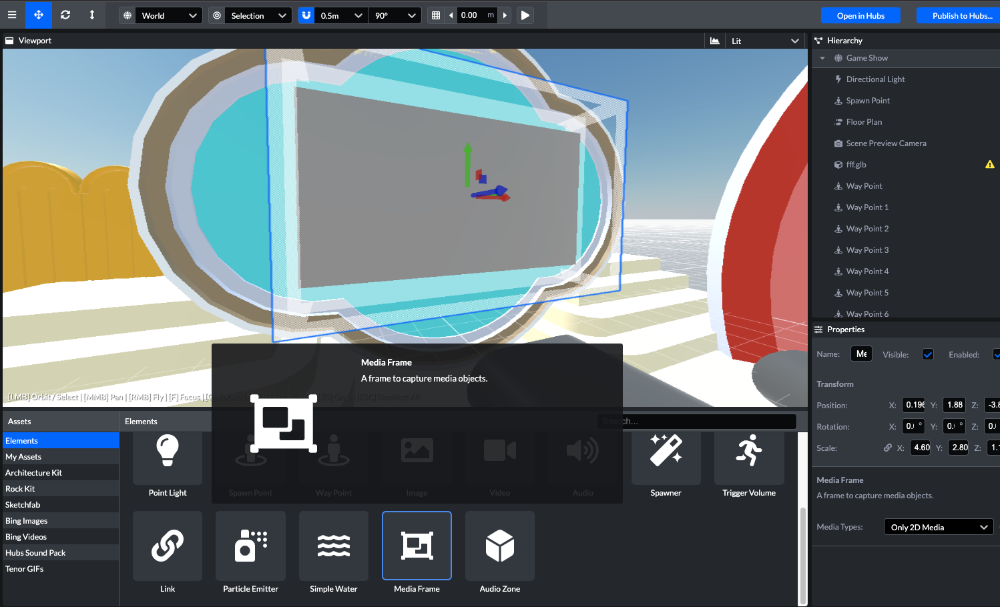

# 创建内容

创建场景后，可以通过添加内容开始自定义场景。Scene编辑器支持多种媒体。请注意，要成功发布到**0xSPACE**，Scene项目的大小限制为**128MB**。

## 3D模型

Scene允许您从Sketchfab搜索3D内容。您可以在“资源”媒体浏览器中找到集合（此功能由于**Sketchfab API**改变，暂不可用，需要将**GLTF** 3D模型转换为**GLB**格式，并上传到**myAsset** 使用）。

如果您有现有的.glb模型，也可以将它们上载到资产库。

## 上传内容

您可以上载自己的现有数字资产以在Scene编辑器中使用。上载内容：

1. 在Scene编辑器的“资源”面板中选择“**myAsset**”（我的资源）选项卡
2. 单击“**myAsset**”面板右下方“**upload**”按钮，然后选择要上载的媒体文件

您还可以将内容拖放到编辑器窗口中以将其上载到Scene。场景的大小限制为**128MB**，场景中文件必须小于该大小。

## 3D模型生成器

如果你想创建一个房间，其中有一个特定的三维对象，人们可以复制，你可以创建一个‘**Spawner**’元素。这有助于简化场景的创建，使多人能够快速获取同一对象的自己的副本。为此，您需要复制所需模型的URL，从Asset panel > Elements tab 选项卡选择并创建一个“Spawner”元素，并将URL粘贴到properties框中。

## 图像

图像可以选择二维投影或360度投影的方式（360度投影一种可以用作天空盒或其他类型场景背景的格式）加入Scene。可以从您自己的计算机上传图像或GIF到Scene，或使用内置的搜索工具在线查找媒体并上传。

## 视频

您向Scene中添加在线视频链接，以创建视频内容播放器。Scene尝试自动播放任何类型的流式视频内容或直播流。YouTube和Twitch URL通常适用于流媒体，你可以在场景中加入一个永久视频链接。像图像一样，视频可以是二维投影，也可以是360度投影方式。

值得注意的是，可以将Scene中视频配置为自动播放或者循环，但无法更改在场景发布到0xSPACE后视频的链接。但是可以临时添加视频到房间中，并将其固定（Pin）到房间。

*如果要使用其他类型的内容源，例如桌面或网络摄像头的屏幕或屏幕共享，则可以在使用场景创建房间后后添加这些源内容。*

## 音频

您可以向场景中添加.mp3音频文件链接。但是，目前还没有音频剪辑控件。

我们建议将音频文件直接上传到0xSPACE，这样您就可以访问音量控制。

## 粒子发射器（Particle Emitter）

粒子发射器是一个Scene对象，它产生移动粒子。

## 链接（Link）

您可以在场景中包含指向其他中心房间或web上不同位置的链接。要在分支中创建link元素，请在Elements下选择&#39;link&#39;元素。选择链接元素后，将URL粘贴到“属性”面板中。当您的场景发布并用于在中心创建文件室时，URL将解析为其文件类型并根据内容类型显示。如果您使用指向常规网站的URL，集线器将尝试截屏并在link元素所在的位置显示该内容。如果无法解析url，它将显示损坏的媒体图像。

## 媒体框（Media Frames）

您可以使用“媒体框”元素来指定视频、图像、屏幕共享放置区域位置和大小。媒体框可以接受二维媒体和三维模型 （模型或媒体的大小将跟随媒体框的设置）。

## 音频区域

音频区域是根据音频源和听众相对的远近位置修改音频源（化身、视频、音频、音频目标等）音量大小。一个明显的应用是根据3D区域（如房间）调节音频源的音量，以模拟真实世界的行为。

音频区域基于音频源和侦听器的位置工作

- **输入**：当侦听器在区域外时，音频区域的参数将应用于音频区域内的音频源音量。
- **输出**：当侦听器在内部时，音频区域的参数将应用于音频区域之外的音频源音量。

*禁止所有来自内部的音频源的输入区。*

*屏蔽所有来自外界的音频源。*

音频区域可以位于其他音频区域内，在这种情况下，应用的参数将是限制性最强的参数的减少。

*如果在听者和源之间有两个音频区域，第一个有增益 == 0.1，另一个有增益 == 0.5，增益 == 0.1 应用于源。*

