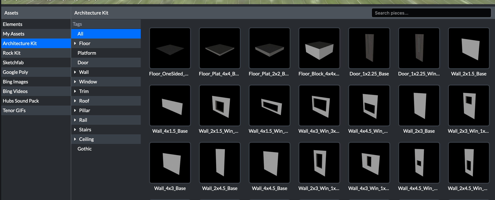
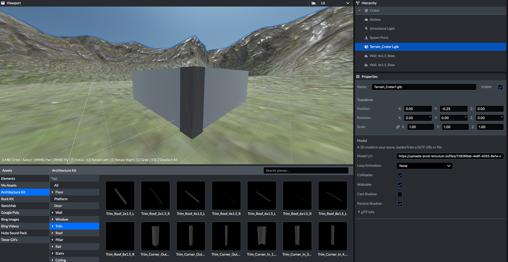

# 建筑学工具包-Architecture Kit

随着建筑学工具包的推出，创作者现在有了一种额外途径，可以在不使用外部工具的情况下为他们的3D场景构建自定义内容。该建筑学工具包的设计目的是为了更容易地利用已经针对虚拟现实优化的现有组件，使用这些组件让创建模型和场景变得更加容易。

该工具包套件包含了400多个不同的部件，这些部件被设计成可以一起使用来创建建筑，这些部件包括墙、地板、天花板和屋顶部件，以及窗户、饰件、楼梯和门。

## 如何使用建筑学工具包

前往Scene编辑器开始一个新的项目。在资产面板中，找到标有“Architecture Kit”的部分

将组件从“资源面板”拖放到场景中。在对象的“属性”面板中更改纹理材质。

## 制作双面套件

在房间中放置对象后，您可能会注意到它们的正确显示还取决于您从哪个方向观察它们。这是因为所有对象都是单面的，这有助于提高性能。它还允许创作者让墙的一面使用不同于另一面的材料，例如，室内彩绘墙和带有砖的外墙。如果要使墙双面，请复制（ctrl +c，command+c）并粘贴（ctrl +v，command+ v）对象，然后按Q或E键两次将其旋转180度。

## 添加饰件

默认情况下，像墙板这样的套件在拐角处不是完全连接的。你可能会发现在特定的外角有一个很窄的间隙。这些饰件就是为配合连接而设计的。

