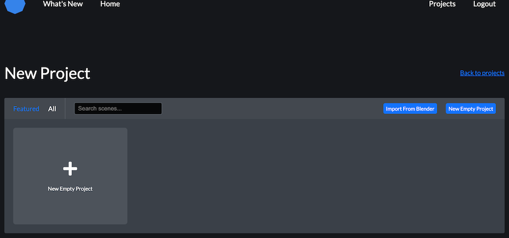
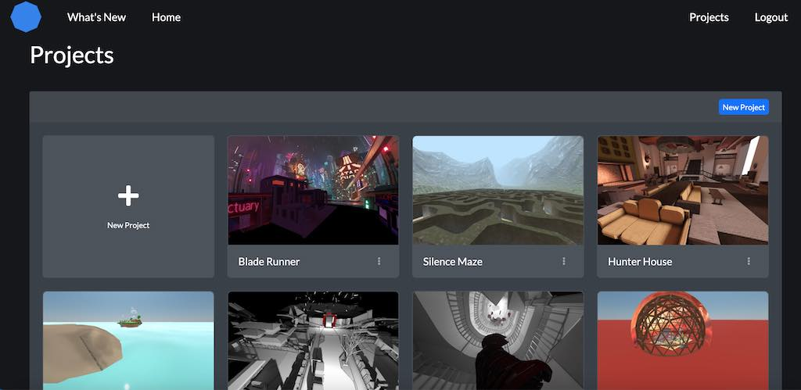
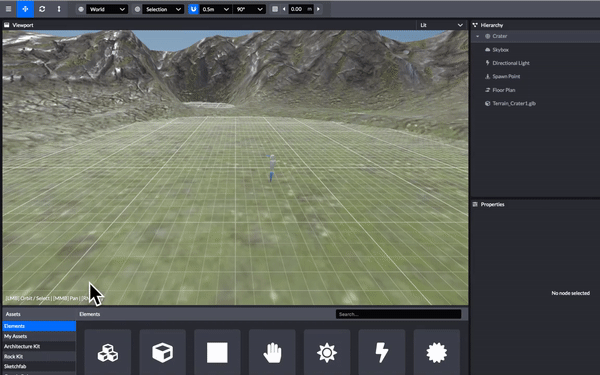
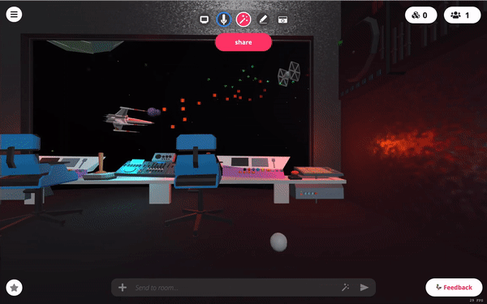

# 创建项目

在Scene编辑器中，您可以从头开始创建一个新项目，重新组合现有的房间场景，或者导入某人发送给您的Scene项目。

## 开始新项目

创建新项目的，单击“开始”

如果是第一次，您可以选择按照教程来熟悉这些功能。如果您以前在Scene中创建过场景并已登录，您将在此处看到以前的项目。

选择“newproject”，您就可以从现有场景中选择进行再创作，或者选择“new empty project”从头开始。

从这里你可以定制你的场景完全你喜欢！试试添加你的内容或者用Scene编辑器自带的的architecture-kit套件

## 再创作场景

发布具有creative commons许可证场景是可以再创作的。可以按如下方式将它们导入Scene：

1. 从使用该场景的房间内打开下拉菜单
2. 选择“room & scene info”
3. 单击场景的名称以打开其登录页
4. 选择在场景中打开并编辑
   
   

## 导入.spoke场景文件

如果有人想与您共享其房间场景，可以将其导出为.Spoke文件，并发送给你以导入

