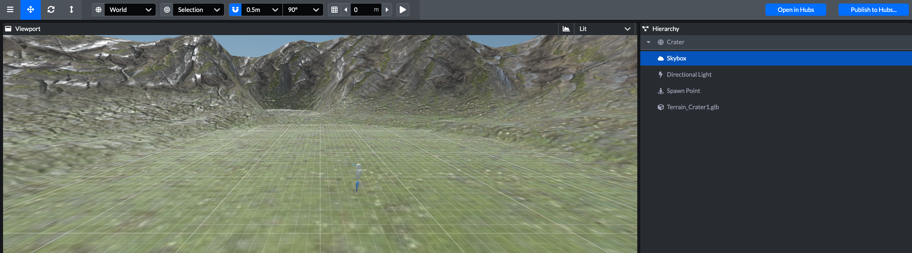
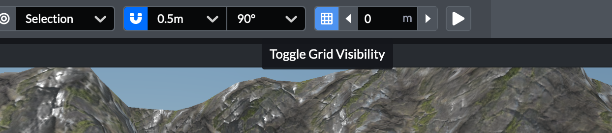
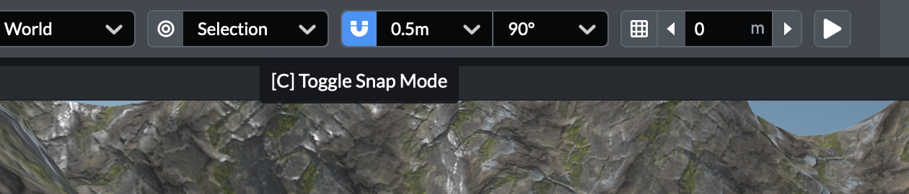
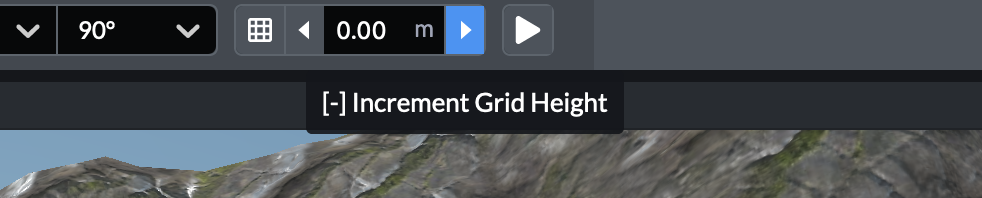

# 网格(Grid)

第一次在Scene中创建新场景时，将在“视口”窗口中看到网格。要显示或隐藏网格，请按上方菜单中的“切换网格可见性”（Toggle Grid Visibility）按钮。

默认情况下，捕捉模式处于启用状态，对象将自动与栅格对齐。要禁用此功能，请按“切换捕捉模式”（Toggle Snap Mode）按钮。

可以通过更改“切换捕捉模式”按钮旁边框中的数字来微调网格的大小。默认情况下，网格的正方形为0.5米。接下来，你可以改变一个物体的旋转量，当你按下 **Q + E**按钮时，对象被选中。

首次加载场景时，网格将位于y轴访问的0高度。但是，如果正在处理具有多个标高的场景（例如房屋中的楼层），则可能希望增加或减小网格的高度，以便在对象未与地面齐平时更容易定位对象。

