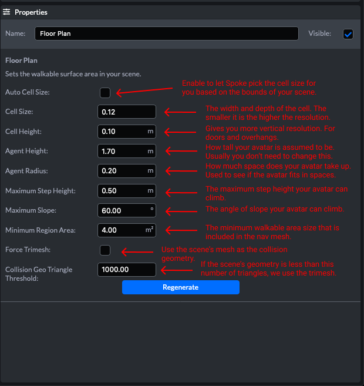

# 物理特性与导航

# 楼层平面图元素

楼层平面图定义了您可以在哪里行走，以及可交互对象如何与场景发生碰撞。它将创建一个导航网格 （Nav Mesh ，您可以在其上行走，当您选中时显示为蓝色网格）和碰撞网格（与哪些对象发生碰撞，红色或黄色网格取决于您使用的是trimesh还是heightfield）。

## 导航网格生成

单击“重新生成”并发布场景时，Scene通过执行以下操作生成导航网格：

首先**Scene**编辑器将场景中的所有可行走几何体合并为一个大网格。然后**Scene**编辑器将体素化网格。如果你曾经见过MC我的世界，你的网格将被转换成类似于我的世界。其中体素的大小由单元大小与单元宽度定义。

如果你有一个大场景，将需要很多体素。有时太多的体素会崩溃。所以Scene有自动单元尺寸复选框，它将尝试保持合理数量的体素。检查它可能会得到很好的结果，但是通常Scene可以通过调整这些值来获得更好的结果。

所有决定你是否能在某个区域行走的算法都是根据这些体素计算的。所以分辨率越高，它就越像你的真实场景。例如，如果有一个1米宽的门口，而单元大小为0.25米，则体素化数据结构中，门的宽度可能仅为0.75米，因为其中一个体素与门的侧面相交。计算楼层平面时的所有其他参数都取决于单元大小和单元高度。所以，试着把单元的尺寸缩小到0.1米这样的小尺寸，如果它拒绝再生或者在花费太长时间，就增加它。

一旦调整了单元大小和单元高度，就可以使用其他参数解决其他各种问题。如果你有一个通道是不可访问的，你可以减少代理半径或代理高度，这样虚拟化身将适合通过体素化的通道。如果你有一个斜坡、楼梯或小山，你不能爬，试着调整最大台阶高度和最大坡度。这些参数控制可以向上行走的对象的高度以及路径的最大坡度。你可能有一系列的小区域，比如小溪中间的一些垫脚石，因为它们太小而不能行走。“最小区域面积”（minimum region area）控制该区域在从nav mesh中排除之前可以有多小。注意，代理半径在这里也很重要。

有时，网格对使用navmesh生成器不是很友好。在这些情况下，建议在**Blender**中创建自定义nav mesh。它可以是作为单独模型添加到分支场景的简化网格。标记为可步行。然后将其替代的其他模型标记为不可行走。对于nav mesh的较小修复，可以使用“盒子碰撞器”（Box Collider）来创建可行走区域。

## 碰撞网格生成

对于碰撞，Scene有两种生成碰撞网格的方法。第一个是trimesh，它是场景中所有可碰撞网格的组合。如果三角板过密，可能会导致碰撞系统的性能问题。因此，Scene也有高度场。

height field将场景分成二维网格。从上面看，高度场是通过找到每个网格单元中心的高度来构建的。最后看起来有点像你把一块布搭在你的环境上。对于室外地形，它的效果相对较好，但是当有较小的可碰撞物体、墙壁和悬垂物时，它会受到影响。height field 无法为多级场景创建精确的碰撞网格。它只会为场景中所有可碰撞几何体的顶层创建碰撞几何体。

除了这两种方法外，还可以使用盒子碰撞器（Box Collider）。它们是简化的碰撞器，当你有一个复杂几何体的网格时，很可能要用上它。

