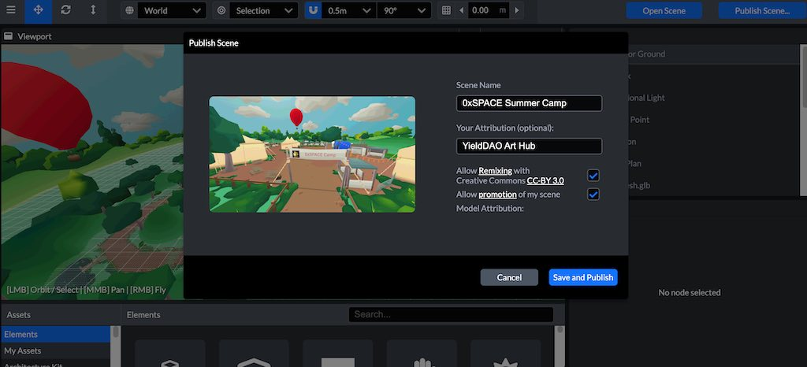

# 发布场景

可以直接将场景发布到0xSPACE，也可以将其导出为.glb文件或传统Scene场景。

## 发布到0xSPACE

发布到0xSPACE时，场景将具有唯一的URL。在这个登录页面上，有一个链接指向“创建具有此场景的房间”，您可以使用该链接创建以场景为基础的0xSPACE房间，以及其他人可以用于在Scene中再创作（Remix）的链接。



在将场景导出到0xSPACE之前，请始终记住生成楼层平面图！

单击右上角的“**发布场景**…”按钮。您将收到重命名场景的提示。

您需要登录“保存”并发布场景。你只需要发送一个链接到你的电子邮件。

添加属性，然后单击“保存并发布”

如果已从Scene中的“搜索”面板中添加模型，则内容的属性将自动添加到场景描述中，但您可以为从外部源引入的内容添加其他属性。

您可以选择：

- 允许与Creative Commons CC-BY 3.0 Remix 再创作-允许用户将您的场景用作自己的基本模板
- 允许0xSPACE将场景添加到可公开访问的场景数据库中（如果允许相关规则）

## 导出为.glb文件

导出为.glb（glTF binary）文件将场景导出为单个.glb文件，该文件可用于支持加载glb文件的其他程序。请注意，glb是一个编译的二进制文件，不能像glTF文件那样以可读的文本格式打开。

```
In the dropdown menu, select File > Export as binary .glTF (.glb)
```

## 导出为.spoke文件

导出为传统Scene场景将创建一个.Spoke文件，该文件可以导入到另一个Scene用户帐户中。您还可以通过将场景标记为“可重创作” （Remix）并与其他人共享场景链接来共享Scene中的场景。

```
In the dropdown menu, select File > Export legacy .spoke project
```

