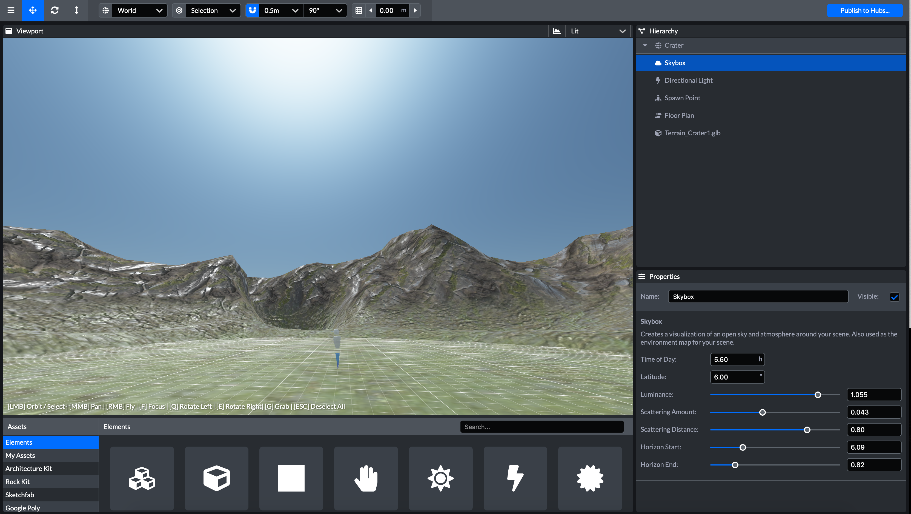
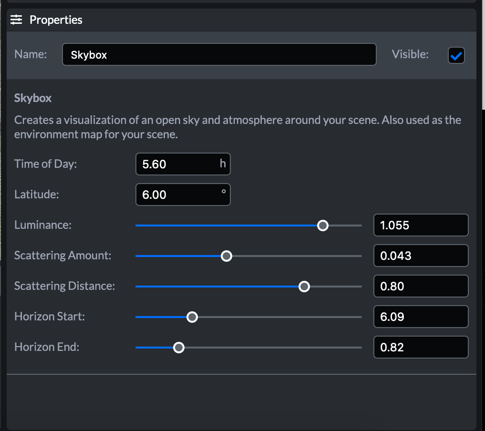

# 天空盒（Skybox）

Skybox天空盒可以显著影响场景的氛围。除非从移除了默认元素的模板开始，否则开始时场景中默认有一个skybox。

skybox属性面板允许您微调现有的skybox。可以更改以下质量：

- 一天中的时间
- 纬度
- 亮度
- 散射量
- 散射距离
- 地平线起点
- 地平线终点

## 自定义skybox

无法添加自定义Skybox到场景中。但是，一个解决方法是在场景中插入360度图像以遮挡现有的天空盒。例如，请看下面起伏山丘的场景就是一副360度图作为skybox作为背景。

