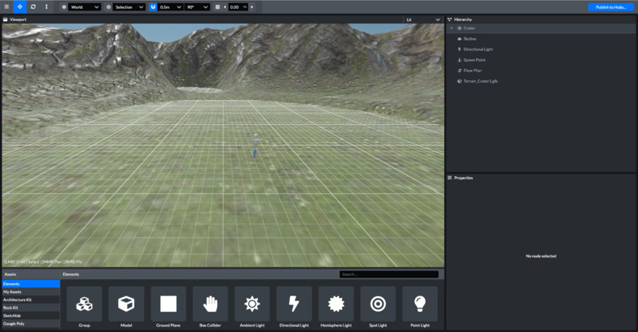
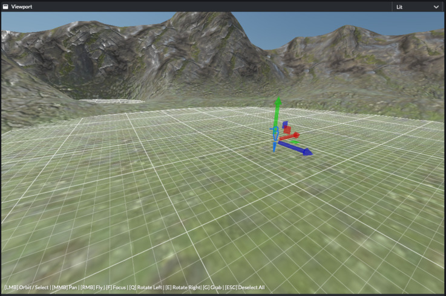
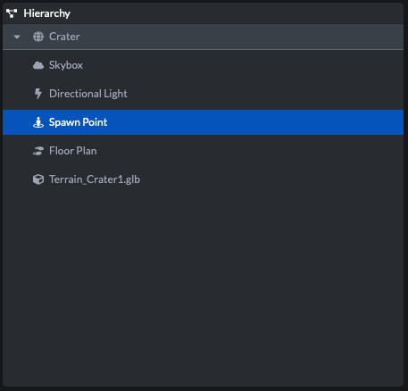
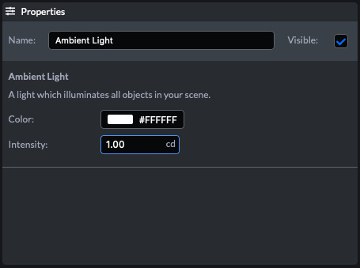
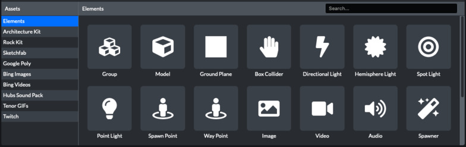
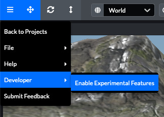

# 用户界面

## 工具栏

### 1.下拉菜单

在下拉菜单中，您将找到保存、另存为、导出文件的选项，以及如何使用**Scene编辑器**的帮助。

### 2.转换工具

**翻译[T]**：显示平移小控件，拖动箭头可沿X、Y或Z轴移动对象。也可以使用“抓取”工具移动对象。选择对象时，按G键获取选择，移动鼠标并单击以将对象放置在场景中。再次按Esc或G可取消当前抓取操作。

**旋转[R]**：显示旋转gizmo，拖动gizmo的环以沿X、Y或Z轴旋转对象。

**比例尺[Y]**：显示缩放小控件，拖动小控件的中心立方体以向上或向下缩放对象。

### 3.网格工具

**切换变换空间[Z]**：-关于变换空间——它将变换gizmo更改为面向世界XYZ而不是对象的XYZ。除非旋转对象，否则不会真正看到差异。比如，把车旋转45度。然后，要“前进”，您需要切换到对象的局部轴

**变换轴[X]**：有时，如果模型的轴点设置不正确，放置对象可能会很困难。可以使用此下拉菜单更改轴的计算方式。可以设置为中心、底部或选择。

**切换捕捉模式[C]**：有时你可能想移动和物体与一个预先看到的位置或旋转。为此，通过单击磁铁图标来切换捕捉模式。可以使用下拉菜单设置平移和旋转捕捉设置。

**捕捉模式控件**：确定应用转换工具的精确程度

**切换网格可见性**：显示/隐藏三维栅格上的栅格。在放置模式下，对象可以放置在其他对象或网格的顶部。垂直构建时，可以更改栅格高度

- 出版社`=`增加栅格高度的步骤
- 出版社`-`减小栅格高度的步骤

### 4.发布到0xSPACE

单击此按钮可打开“发布”对话框，您可以在其中编辑场景信息，然后再将其发布到0xSPACE。

## 视口面板（ViewPort）

视口显示场景的预览，您可以在其中选择和移动对象。

> 请注意，当您将场景发布到0xSPACE时，无论视口在看什么，都将是场景的缩略图图像。

### 对象选择

可以通过单击对象来选择对象（按住shift键可选择多个对象）。

### 摄像机运动

左键单击并拖动以环绕场景。按住鼠标右键进入飞行模式，在该模式下，可以使用鼠标环视场景，并使用**W A S D**键移动摄影机。按`F`键以聚焦选定对象

### Gizmo变换

选择一个或多个对象后，将显示gizmo变换。

## “层级”面板

添加到场景中的对象将显示在“层次”面板中。双击对象使其在视口中聚焦。可以在“层次”面板内拖动对象以对其重新排序或重新排列。也可以将“资源”面板中的项目和计算机中的文件拖放到“层次”面板中，以将它们添加到场景中。

## “属性”面板

可以在“属性”面板中设置其他对象属性。这包括阴影、浅色等。

对象被添加到分支，可以通过更改其属性进行自定义。不同类型的对象具有不同的可用属性（例如，灯光具有“强度”属性，而三维模型则没有）。大多数对象都有变换属性，表示空间中的物理位置。

## 资产面板

可以在“资源”面板中找到要添加到场景中的内容。可以单击资源将其添加到场景中。也可以从“资源”面板拖动资源并将其放置到“视口”、“层次”面板或“属性”面板上。

### 资产源

“资源”面板的左侧是源列表：

#### 元素（elements）

元素是Scene编辑器中的基本构建块。你可以在这里找到灯光、媒体、出现点和其他类型的对象。

#### 我的资产（myAsset）

上传和搜索您自己的三维模型，图像，视频和音频。

#### 体系结构工具包（architecture-kit）

体系结构工具包中包括了可以组合在一起构建各种结构的部件。此套件包含地板、墙、楼梯等。

#### 岩石工具包（rock-kit）

岩石套件工具包包含一组真实的岩石模型，可用于添加地形细节、构建平台或任何其他需要岩石的地方。

#### Sketchfab

Sketchfab是一个三维模型的在线市场。它包含各种各样的高质量模型来帮助您填充场景。 

#### 实验特性

我们一直在为Scene编辑器开发新功能。要试用它们，可以启用实验特性。请注意，这些特性仍处于测试阶段，可能不会继续受支持。

